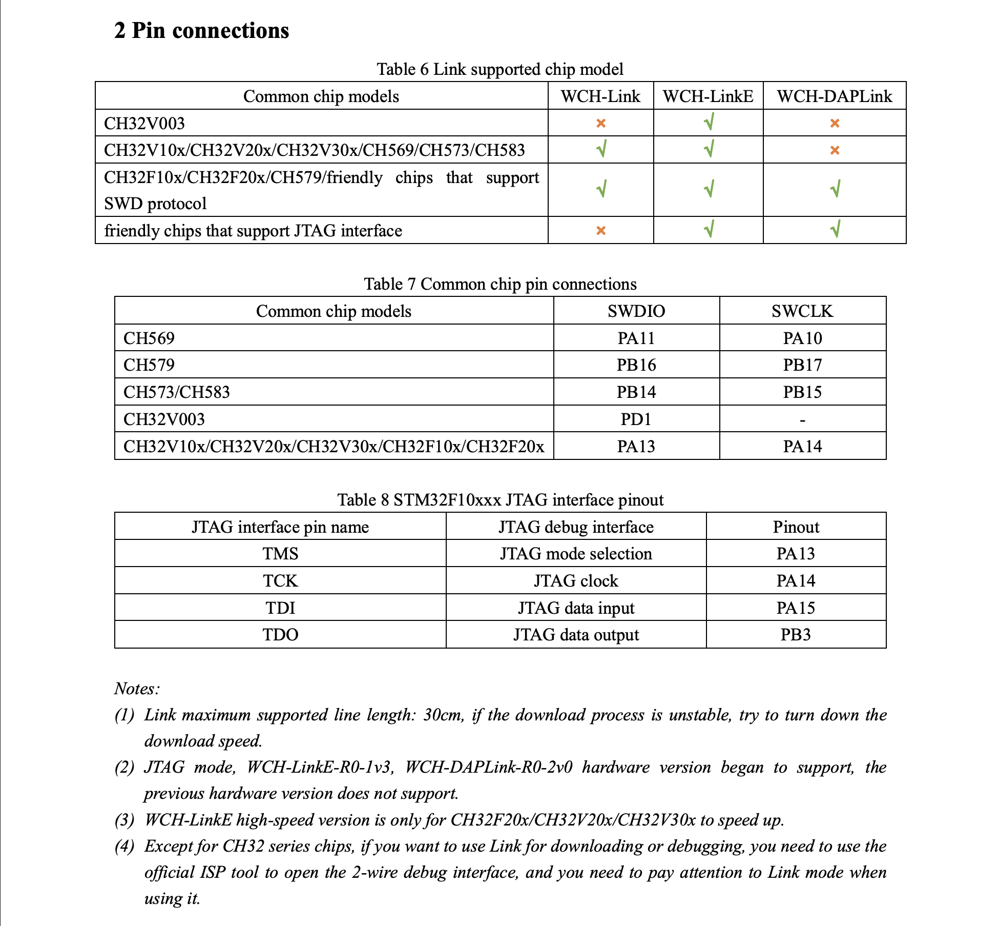
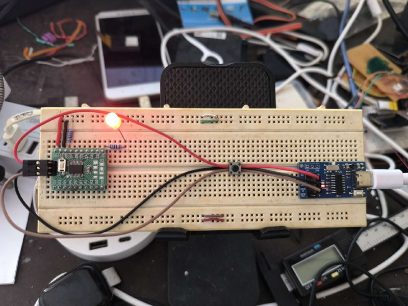
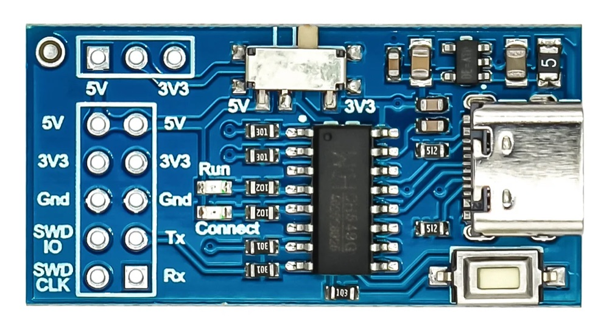
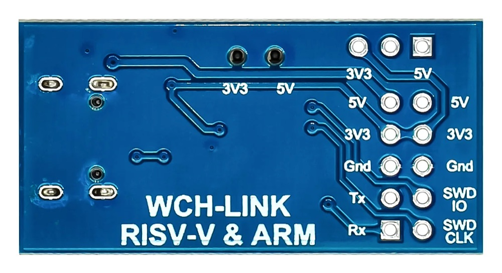
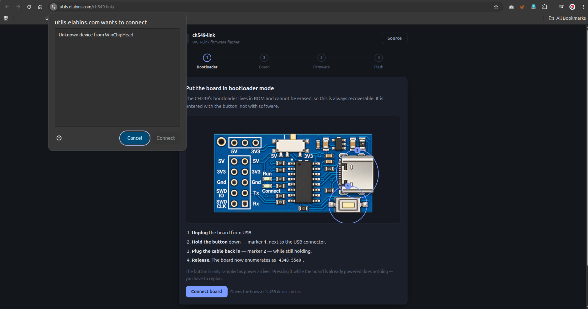
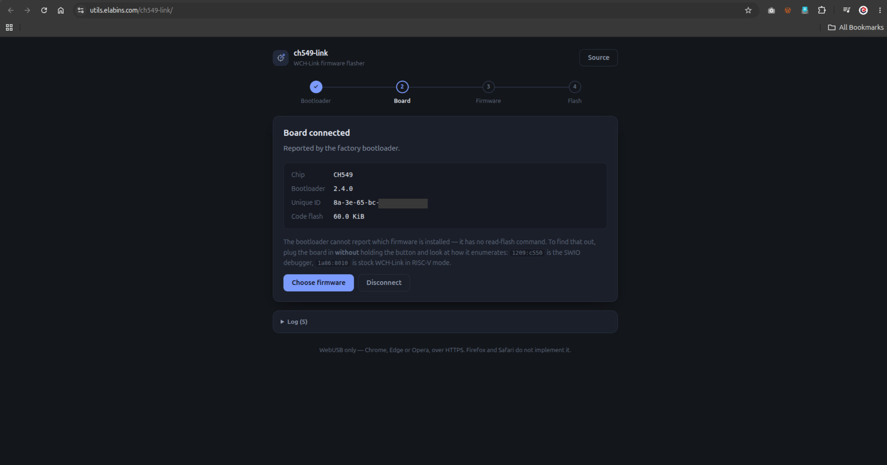
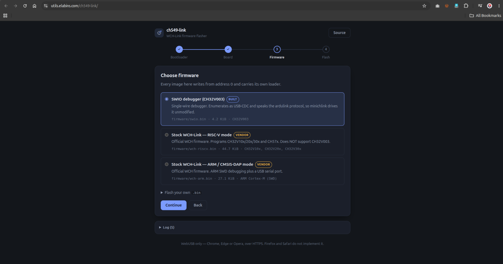
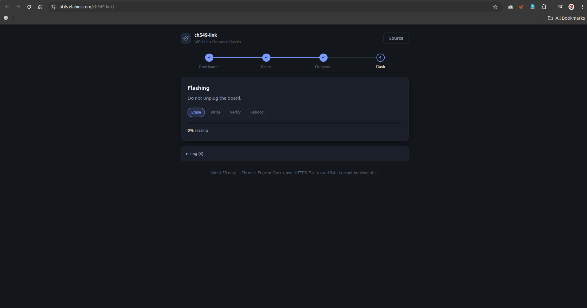
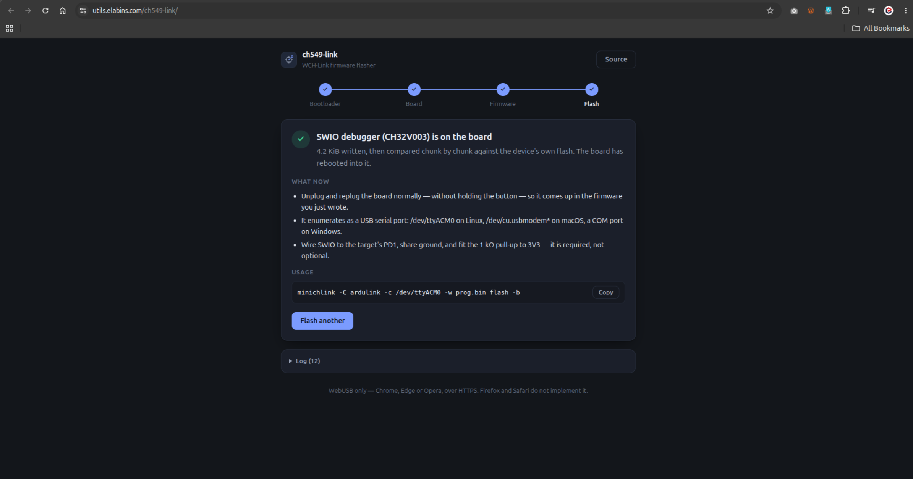

<p align="center">
  
</p>

<h1 align="center">ch549-link</h1>

<p align="center">
  Turn a <strong>CH549-based WCH-Link</strong> into debuggers it was never meant to
  be — starting with a <strong>CH32V003 single-wire (SWIO) programmer</strong>.
</p>

WCH's own manual marks CH32V003 as unsupported on this hardware, and vendors sell
these boards with "CH32V003 not supported" in the listing. Both are correct about the
**stock firmware**. Neither is correct about the **hardware**.

<p align="center">
  
  <br><em>WCH-Link manual, Table 6 — CH32V003 marked ✗ for WCH-Link</em>
</p>

<p align="center">
  <a href="https://elabins.com/blog/making-a-wch-link-clone-program-the-unsupported-ch32v003">
    <picture>
      <source media="(prefers-color-scheme: dark)" srcset="https://elabins.com/widgets/post/making-a-wch-link-clone-program-the-unsupported-ch32v003.svg?theme=dark">
      
    </picture>
  </a>
</p>

```
$ minichlink -C ardulink -c /dev/ttyACM0 -w blink.bin flash -b
Detected CH32V003
Flash Storage: 16 kB
Image written.
```

The board enumerates as a USB CDC device and speaks the [ardulink][ardulink] protocol,
so **stock `minichlink` drives it unmodified**. One USB-C cable, no adapter.

<p align="center">
  
  <br><em>CH32V003 running blink, flashed through the CH549 WCH-Link</em>
</p>

[ardulink]: https://gitlab.com/BlueSyncLine/arduino-ch32v003-swio

## Hardware

<table>
<tr>
<td width="50%"></td>
<td width="50%"></td>
</tr>
<tr>
<td align="center"><em>Top — CH549, slide switch, USB-C, button</em></td>
<td align="center"><em>Bottom — the header labels this project uses</em></td>
</tr>
</table>

The header is silkscreened for ARM SWD. The SWIO firmware reuses the `SWDIO` pad as
the CH32V003's single-wire line — see [Wiring](#wiring).

Any WCH-Link whose MCU is a **CH549** — confirm it before starting:

```bash
# in RISC-V mode (1a86:8010), ask the probe what it is
# reply 82 0d 04 <major> <minor> <variant>;  variant 0x01 = CH549
```

Variant `0x12` is a WCH-LinkE — it already supports CH32V003 natively and does not
need any of this.

### Wiring

```
CH549 P1.1 ──┬── SWDIO pad ── CH32V003 PD1
             │
            1kΩ        ← REQUIRED, not optional
             │
           +3.3V

GND ─── target GND
3V3 ─── target VDD     (slide switch to 3V3, not 5V)
```

`SWCLK` stays unconnected — the CH32V003 has no clock pin. That missing pin is exactly
why the stock firmware cannot drive it.

The **1 kΩ pull-up is required**. Without it the link is unreliable: garbage chip IDs,
failed writes. Verified by removing and refitting it.

## Flashing the WCH-Link

### Web flasher (no toolchain)

Open the GitHub Pages site and follow four steps:

1. **Bootloader** — hold the board's button while plugging it in.
2. **Board** — chip, UID, bootloader version and flash size, as reported by the
   factory bootloader. It cannot tell you which firmware is installed; nothing can.
   To find that out, plug the board in *without* the button and read the USB ID:
   `1209:c550` is the SWIO debugger, `1a86:8010` is stock WCH-Link in RISC-V mode.
   Why verify-based identification does not work is written up in
   [docs/isp-protocol.md](docs/isp-protocol.md).
3. **Firmware** — pick one, or supply your own `.bin`.
4. **Flash** — erase, write, verify, reboot, with a progress bar and a log.

<table>
<tr>
<td width="50%"></td>
<td width="50%"></td>
</tr>
<tr>
<td align="center"><em>1 · Bootloader</em></td>
<td align="center"><em>2 · Board</em></td>
</tr>
<tr>
<td width="50%"></td>
<td width="50%"></td>
</tr>
<tr>
<td align="center"><em>3 · Firmware</em></td>
<td align="center"><em>4 · Flash</em></td>
</tr>
<tr>
<td colspan="2"></td>
</tr>
<tr>
<td colspan="2" align="center"><em>Done — verified, rebooted, with the <code>minichlink</code> command to use next</em></td>
</tr>
</table>

Chrome, Edge or Opera only — WebUSB is not implemented in Firefox or Safari.

#### Developing it

Hardware is the bottleneck, so the flasher can be driven against a simulated CH549
bootloader instead:

```bash
python3 tools/mockserve.py
# http://localhost:8731/?flash=swio&delay=2
```

`?flash=blank` exercises the "not recognised" path and `?failAt=2016` the failure path.
The simulator lives in `tools/`, so `make dist` never ships it.

### Command line

```bash
# hold the button while plugging in -> board appears as 4348:55e0
isp55e0 -f dist/firmware/swio.bin
```

The bootloader lives in ROM and **cannot be erased**, so a bad flash is always
recoverable: unplug, hold button, plug in, reflash.

## Building

With Docker (no local toolchain):

```bash
make docker      # builds firmware/*/build/*.bin in a pinned SDCC 4.5.0 image
make manifest    # assembles dist/ for the web flasher
```

The image pin matters: the vendored ch55xduino USB sources need SDCC 4.5.0, and
Ubuntu's current `sdcc` package is 4.2.0. CI builds through the same Dockerfile for
that reason.

Or natively, with SDCC 4.5+:

```bash
make dist        # firmware + manifest
```

## Layout

```
firmware/common/     USB-CDC stack + CH549 headers, shared by all debuggers
firmware/swio/       CH32V003 single-wire debugger
vendor-firmware/     WCH's stock images (see that folder's README)
web/                 WebUSB flasher, deployed to GitHub Pages
tools/               manifest generator + a simulated bootloader for UI work
docs/                how this works, and how it was worked out
```

Adding a debugger = a folder under `firmware/` and an entry in
`tools/make_manifest.py`. The web UI reads `manifest.json`; it needs no changes.

## Status

| Debugger | Target | State |
|---|---|---|
| `swio` | CH32V003 | working — detect, write, verify, run |
| `sws` | Telink TLSR | planned |

## Credits

- [ch32fun / minichlink](https://github.com/cnlohr/ch32fun) — host-side tooling
- [arduino-ch32v003-swio](https://gitlab.com/BlueSyncLine/arduino-ch32v003-swio) — the
  SWIO implementation this was ported from
- [ch55xduino](https://github.com/DeqingSun/ch55xduino) — SDCC USB-CDC stack and CH549
  headers
- [isp55e0](https://github.com/frank-zago/isp55e0) — WCH ISP protocol, reimplemented in
  JS for the web flasher

## Licence

Project code: see `LICENSE`. Vendored third-party sources keep their own licences —
see `firmware/common/` and `vendor-firmware/README.md`.
